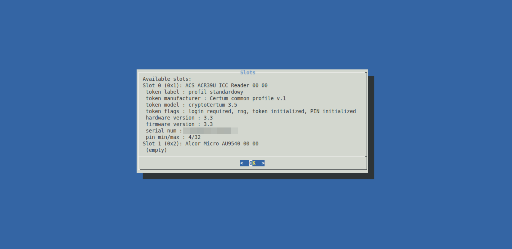

# certumctl
 

## Description

This is a 'simple' `bash` and `dialog`-based script to help you deal with Certum
smartcards without having to pull your remaining hair out. So far the
following OSes are supported:

- Debian 12
- Linux Mint 21
- Ubuntu 22.10
- Ubuntu 22.04

## Features

- Automatic installation of required libraries on supported OSes
- Automatic starting of required services on supported OSes
- Listing available slots on a card
- Listing key types available for a card
- Generating a keypair and storing it on a card

## Installation and usage

1. Clone/download the repository
2. Run `bin/certumctl.sh`

## Dependencies

- `dialog`
- `wget`
- `readlink`
- Certum's smartcard libraries (included in `./lib`)

Other dependencies can be dynamically installed by the script.

## [Changelog](./CHANGELOG.md)

## Screenshots

## Source for libraries

[https://pomoc.certum.pl/pl/oprogramowanie/procertum-cardmanager/](https://pomoc.certum.pl/pl/oprogramowanie/procertum-cardmanager/)

## License

This project, except the proprietary Certum libraries, is licensed under the [GNU AGPL-3.0-or-later](https://www.gnu.org/licenses/agpl-3.0.html).
